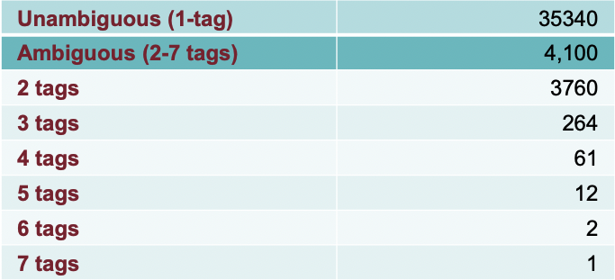
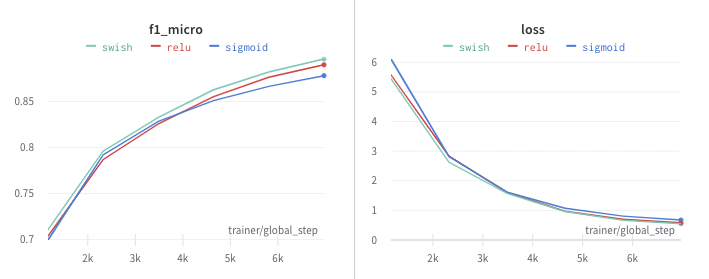

# Assignment 3 - Neural WSD
In this document, we provide an overview of the problem we had to solve and describe the ideas we followed throughout the project. To know more about the technologies or the datasets involved in the project, please take a look at the related sections in the first assignment. For further details on the results achieved or interesting training details, please refer to their respective dedicated sections in the second assignment. In the following, we will further expand on some of the above-cited points and describe the core reasoning and challenges posed by the task of Word Sense Disambiguation (WSD).

## Project topic
In this project, we focused on a historical problem in Natural Language Processing (NLP) that is to determine what meanings are activated by the use of words in a given context. The task is known as Word Sense Disambiguation (WSD) and is a supervised classification task where the goal is to connect each concept to its related senses in a Knowledge Base (KB). The complexity behind the task lies in the fact words are ambiguous by nature. More formally, given a word $w$ and a context of surrounding words $c$, we define the senses $S$ associated to $w$ with a function $\phi$, where $S=\phi(w, c)$. It is worth noting how the general formulation of the task enables $S$ to contain multiple senses for a given target word $w$. Sometimes multiple senses may be associated with a single word in context and we as humans may find it hard to pick the best sense [[Conia et. al, 2021](https://aclanthology.org/2021.eacl-main.286)]. However, it is common to reduce the number of candidates to one, since every sense $s$ in $S$ is considered correct, thus leading to the classic token classification formulation. Along this direction, we frame the problem as a supervised classification task where the model learns to predict a synset identifier in WordNet 3.1 for each concept word.

## The challenges
The task of associating the correct sense of a word involves a strong level of semantics and poses multiple challenges. The meaning of a word is heavily influenced by their surrounding terms: "You shall know a word by the company it keeps" (Firth, 1957). Here we list some of the challenges involved:

- A first challenge that arises when discriminating the correct sense of a word lies in the frequency they appear with. It has been observed in the Brown corpus that only the 11.5% of word types (lemmas) are ambiguous. However, the 40% of tokens available in the corpus can be associated with more than a sense, meaning that ambiguous word types are rare but are extensively used in our life, leading to a high semantic ambiguity.

<figure align="center">
  
  <figcaption>Fig.1 - Ambiguous word distribution in the Brown corpus, on the right side frequencies for each category are shown.</figcaption>
</figure>

- Furthermore, the majority of sense-annotated datasets feature annotations that are unbalanced towards the majority class. The phenomenon is described by [Zipf's Law](https://en.wikipedia.org/wiki/Zipf%27s_law), also known as long-tail law, which says that the frequency of any sense is inversely proportional to its rank in the frequency table with exponential decay. According to this hypothesis, for any ambiguous term with the related set of associated senses, a few senses appear with high frequency and lots of senses appear with low frequency. Even though the statistical distribution of senses should provide us a hint for the disambiguation task, it would fail in the case of less frequent meanings. It is the case of most real-life scenarios when we refer to an ambiguous term with a rare meaning.

- Another issue is related to the granularity of sense inventories, as investigated by [Lacerra et. al, 2020](https://ojs.aaai.org/index.php/AAAI/article/view/6324). The task of disambiguating a word in context into its correct meaning may seem trivial for us because we do it in our everyday life. However, the granularity at which we expect WSD systems to operate may pose some additional challenges. For instance, let's consider the first two meanings of the word *street* in WordNet 3.1:
    - *a thoroughfare (usually including sidewalks) that is lined with buildings.*
    - *the part of a thoroughfare between the sidewalks; the part of the thoroughfare on which vehicles travel.*

    It follows that a WSD system should be complex enough to tackle such fine-grained cases, yet feature good generalization capabilities to reflect its real prediction capabilities at inference time.

- Moreover, words can be ambiguous from different viewpoints: syntactic and semantic. Even though tasks such as POS tagging achieve good performance on the tagging task, the task of resolving the semantic ambiguity is inarguably harder than resolving syntactic ambiguity. The motivation for that is that semantics is hidden from the surface level and to capture it we need to refine our hypothesis to be significantly more complex. Along these lines, word embeddings, and later contextualized word embeddings, served as a proxy to represent word meanings in a more compact latent space than the input space. The idea is to embed large sparse vectors into a lower-dimensional space that preserves their semantic relations.

- A common issue in NLP is the curse of dimensionality problem that leads to great computational burdens and data sparsity in the input sentences. As previously mentioned, different strategies have been proposed to create context-aware word embeddings (as opposed to static word embeddings). Most contextualized word embeddings provide a way to deal with out-of-vocabulary (OOV) words employing different tokenization techniques (e.g. word piece-level tokenization, byte-pair encoding tokenization). However, the problem with this approach is they use complex Language Models (LM), making the training procedure really slow or infeasible in certain cases. A common solution to that consists in taking the pre-trained model on a large corpus and fine-tuning it on the downstream task.

- Finally, we identify a vital linguistic issue. Performing the disambiguation task with a target sense inventory assumes a fixed set of meanings. However, it is not true. As language evolves we need to adapt our disambiguation systems to account for potential mutations in the language itself. It directly translates into a backward compatibility problem that is if we want to test our WSD system with an old dataset we must make sure that it considers the same set of synsets.

## Our approach
We propose a transformer-based architecture that uses contextualized embeddings to get context-specific representations of words depending on their surrounding terms. We employ BERT as the encoder, followed by a plain Multi-Layer Perceptron (MLP) that serves as the decoder part. The idea is to condition prediction $y_i$ for sample $(x_i, y_i)$ on the contextualized representations $h_i$ produced by BERT, where $y_i$ encodes the labels for sense-annotated tokens. More in detail, BERT conveniently produces word piece embeddings to avoid Out-Of-Vocabulary words, which are later averaged to get back to word embeddings.
This simple yet powerful architecture enables us to reach good performance on the test datasets, reaching 64.42% of F1 score as opposed to 61.12% of the MFS baseline.

An in-depth analysis showed us that a large portion of the prediction errors was due to the fact the model never observed some synsets during the training. Moreover, we noticed that in some cases our model wrongly classified some words with unrelated senses. It is worth observing that, in WSD, lexical word information allows us to consider a small subset of related synsets. Along these lines, we extend the previous reasoning by considering every WordNet 3.1 synsets in the sense inventory and including additional prior information in the form of word lexicalizations (i.e. lemmas and POS tags) to mask-out unrelated synsets. The masking process is achieved by setting the logits produced by the model to a very small number in order for the argmax function to ignore them. The resulting F1 scores are 69.31% of F1 as opposed to 67.32% of MFS, respectively bringing an improvement of 4.89% and 6.2%. It confirms our intuition that neural approaches can overcome the difficulties faced by statistical approaches, showing the effectiveness of incorporating lexicalization from the WordNet Lexical Knowledge Base (LKB).

## The role of deep learning
Current state-of-the-art (SOTA) approaches employ deep neural networks as well as similar considerations regarding the use of additional prior information to make accurate predictions. Pre-trained language models outclass previous approaches with static word embeddings. Along these lines, we shape our architecture according to the deep learning paradigm in order to effectively tackle the task. The idea is that by using deep learning, we are able to capture the underlying hidden semantic patterns by learning abstract latent representations. Such latent representations act as the bottleneck of autoencoder models, forcing them to extract better features that ideally match the human concept of meaning. On the other hand, at the end of the deep learning pipeline, the last part of the network, in our case a simple MLP network, is trained to perform the classification task. On the decoder side, we also experiment with more complex architectures such as recurrent neural networks (i.e. LSTM), which didn't improve the results further.

## Project take-aways and insights
In the project, we experiment with different optimization techniques, regularization methods, and model configurations to see which combination provides the best results. Some interesting project insights are:

- Adam optimizer works better than pure Stochastic Gradient Descent (SGD) on the data we consider. It takes advantage of momentum and leads to faster convergence.
- We discover the effectiveness of layer normalization (LN) which, as opposed to classic batch normalization (BN), applies the normalization feature-wise instead of batch-wise. It normalizes the features to zero mean and unit variance and enables faster model convergence.
- Another significant computational speedup is obtained by means of Mixed Precision Training, as originally defined in its [paper](https://arxiv.org/abs/1710.03740), which combines the use of FP32 and FP16 to reduce the required memory footprint. It allows us to perform operations with half-precision digits and in our case reduces the training time of our model from 20min to less than 10min per epoch (training times experienced on a single NVIDIA Tesla P100 with 16GB of VRAM).
- We experiment with different activation functions such as sigmoid, ReLu, and tanh. However, the best results are achieved using the [Swish](https://arxiv.org/abs/1710.05941) activation function that reduces the number of epochs needed for the model to reach a plateau.

<figure align="center">
  
  <figcaption>Fig.2 - Performance of the model on the validation set with different activation functions.</figcaption>
</figure>

- Since the project is carried out in a multiple dataset fashion, we decompose the phase of data preprocessing into subphases. As a first step, we apply tokenization over the input sentences and store them in an intermediate file. When the target vocabulary is selected, we conclude the preprocessing step by indexing labels with the correct vocabulary. The latter is a lightweight phase compared to the first since we no longer need to consider pre-trained tokenizers that are usually slow and require a large memory footprint.
- When dealing with any NLP-related tasks, we should spend lots of time analyzing the quality of the input data, with a particular focus on the outcomes of the preprocessing phase. It is of vital importance to use high-quality data, as well as perform both manual and automated tests to inspect the potential pitfalls of our processing pipeline. Visualization is a great proxy to do it since it allows to gain insights over the dataset and investigate strategies to effectively tackle tokenization, lemmatization, and other data wrangling operations. In our case, we spent great effort on the tokenization and the subword merging phase in order to obtain powerful word-level representations.

## Rethinking our approach
Having the chance to work again on a similar project, some parts of the project would definitely be different. Instead of designing a new system from scratch, it would be interesting to take an existing SOTA approach and test it on a different scenario than the one it was evaluated against. For instance, one could test its performance in a zero-shot setting and observe whether new considerations about the model's behavior could be drawn just by looking at the errors it makes. Perform hyperparameter tuning or apply small modifications to the architecture and observe how these changes affect the performance. It could be worth studying the effects of pruning to ease memory requirements and allow for faster inference. Something else that plays a major role in NLP tasks and should be prioritized in this context is data preprocessing and visualization. For instance, as a future improvement to this project, it could be interesting to investigate which information could be useful for the disambiguation task (e.g. include definitions to make up for poorly represented synsets, encode explicit graph structure as edges that encode semantic relations). Part of the project could be devoted to experiments in cross-lingual and multilingual settings. The idea is that rich languages as English provide us great resources for the monolingual setup, but it may be the case that a synset is better represented in another, potentially low resource, language. Furthermore, extensive experimentation could be done using parallel datasets for the multilingual setup where we are provided with sentences in multiple languages and make predictions in a language-agnostic fashion.

## Time estimates
Being this a project with a focus on software design, we tried to mimic a real-life situation with strict deadlines. For this reason, we took note of the time spent on each phase in order to give an accurate estimate of the time required to complete the whole project. It reflects the need to be able to estimate the initial effort required to complete a given task. Even though the real-time spent on the project is not far from the initial expectations, sometimes more work was required to overcome unexpected challenges, while in other cases the remaining time was dedicated to code refactoring. Efficiently managing the time at each step as well as following the best practices to improve code quality were prioritized throughout the project. More in detail, the data preprocessing step required more time than planned since we had to deal with multiple datasets. In order to provide code modularity, we designed the data pipeline to use different dataset components (e.g. readers) that work as individual processing units, making them perfectly suited for unit testing and ready for potential future improvements (e.g. plan part of the interaction to rely on the RESTful approach). Moreover, the deployment of the model on the cloud took a while to complete because of the additional layer of complexity involved. In this case, we prepared a small deliverable with [Streamlit](https://streamlit.io/) that we eventually shipped to [Heroku](https://www.heroku.com/), a popular platform-as-a-service (PaaS) solution that enables to put systems in production with seamless integration to Git. Additional time was allocated to this part in order to get the system ready for production.

## Technical notes
As a further addition to the project, we thought it could be worth deploying the disambiguation system on a real hosting platform. We consider the Heroku platform for this purpose. It perfectly integrates with Git and allows us to run the apps in isolated Linux containers known as dynos. However, the free tier has strict memory limits (512MB) which prevent us to use it with large transformer networks (i.e. our model requires about 1GB of RAM). We proceed with creating a separate `\webapp` branch, apply some changes to enable CPU inference, and rely on the CPU-version of PyTorch in order for our application to fit in RAM. At this point, our containerized application only consists of the code required to run the disambiguation pipeline, a few precomputed resources as the vocabulary and mappings from WordNet, additional utilities to download the model at startup. Finally, we upload the weights of our model on a separate cloud and be compliant with memory limits. By doing so, we are able to get our system ready for production. As a drawback, we notice that our process gets killed because it exceeds the maximum amount of RAM available in the free tier. Here there are some logs showing the correct operational status of the deployed system, culminated by the sad *SIGKILL* termination message. For a complete log of the system, please refer to the `src/ui/logs/neural-wsd-logs-1640347042268.txt`.

```
2021-12-24T11:26:57.000000+00:00 app[api]: Build started by user leonardo.emili3@gmail.com
2021-12-24T11:30:04.809046+00:00 heroku[web.1]: State changed from up to starting
2021-12-24T11:30:04.518193+00:00 app[api]: Release v5 created by user leonardo.emili3@gmail.com
2021-12-24T11:30:04.518193+00:00 app[api]: Deploy ff88c5e6 by user leonardo.emili3@gmail.com
2021-12-24T11:30:24.382277+00:00 heroku[web.1]: Starting process with command `sh src/ui/setup.sh && python -m streamlit.cli run src/ui/app.py`

...
2021-12-24T11:30:56.509709+00:00 app[web.1]:   You can now view your Streamlit app in your browser.
...

2021-12-24T11:31:06.582173+00:00 heroku[web.1]: Process running mem=1280M(250.0%)
2021-12-24T11:31:06.620196+00:00 heroku[web.1]: Error R15 (Memory quota vastly exceeded)
2021-12-24T11:31:06.645990+00:00 heroku[web.1]: Stopping process with SIGKILL
```
While we want to emphasize the fact that the online system is actually working and accessible [here](https://neural-wsd.herokuapp.com), a fully-working version of the system can be run as a self-hosted server on a local machine with the command `python -m streamlit.cli run src/ui/app.py`.
